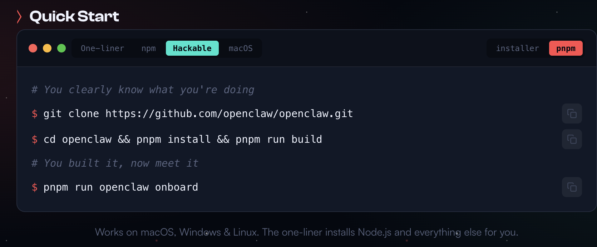

# Production [Installation](https://openclaw.ai/)

## First Installation



### If `pnpm` is not installed

```bash
sudo npm install -g pnpm

# You clearly know what you're doing
git clone https://github.com/openclaw/openclaw.git

cd openclaw && pnpm install && pnpm run build

# You built it, now meet it
pnpm run openclaw onboard
```

## Updating production

```bash
pnpm install && pnpm run build
openclaw gateway restart
```

## How to access form my local computer

http://localhost:18789/?token=<TOEKN>
